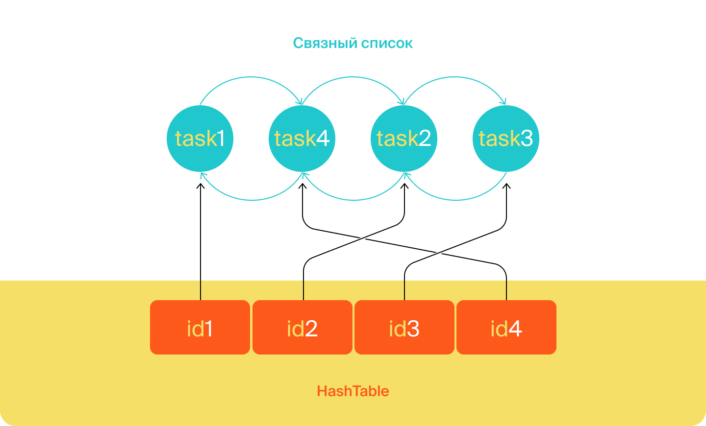

# Техническое задание

### Обратите внимание

Недостаточно реализовать код таким образом, чтобы программа пробегалась по всей истории просмотров и только после этого
удаляла предыдущий просмотр. Ведь тогда время работы этой программы будет линейно зависеть от длины истории.

Ваша цель — реализовать функциональность так, чтобы время просмотра задачи никак не зависело от общего количества задач
в истории.

## Интерфейс `HistoryManager`

У нас уже есть интерфейс, осталось добавить метод `void remove(int id)` для удаления задачи из просмотра. И реализовать
его в классе `InMemoryHistoryManager`. Добавьте его вызов при удалении задач, чтобы они также удалялись из истории
просмотров.

<details>
<summary>Подсказка: структура интерфейса HistoryManager</summary>

Интерфейс `HistoryManager` будет иметь следующую структуру.

```java
public interface HistoryManager {
    void add(Task task);

    void remove(int id);

    List<Task> getHistory();
}
```

</details>

## Дальнейшая разработка алгоритма с `CustomLinkedList` и `HashMap`

Программа должна запоминать порядок вызовов метода `add`, ведь именно в этом порядке просмотры будут выстраиваться в
истории. Для хранения порядка вызовов удобно использовать список.

Если какая-либо задача просматривалась несколько раз, в истории должен отобразиться только последний просмотр.
Предыдущий просмотр должен быть удалён сразу же после появления нового — за `O(1)`. Из темы о списках вы узнали, что
константное время выполнения операции может гарантировать связный список `LinkedList`. Однако эта стандартная реализация
в
данном случае не подойдёт. Поэтому вам предстоит написать собственную.

`CustomLinkedList` позволяет удалить элемент из произвольного места за `О(1)` с одним важным условием — если программа
уже
дошла до этого места по списку. Чтобы выполнить условие, создайте стандартную `HashMap`. Её ключом будет id задачи,
просмотр которой требуется удалить, а значением — место просмотра этой задачи в списке, то есть узел связного списка. С
помощью номера задачи можно получить соответствующий ему узел связного списка и удалить его.


Реализация метода `getHistory` должна перекладывать задачи из связного списка в `ArrayList` для формирования ответа.

#### Подсказки

<details>
<summary>Про CustomLinkedList</summary>

Сначала напишите свою реализацию двусвязного списка задач с методами `linkLast` и `getTasks`. `linkLast` будет добавлять задачу в конец этого списка, а `getTasks` собирать все задачи из него в обычный `ArrayList`. Убедитесь, что решение работает. Отдельный класс для списка создавать не нужно — реализуйте его прямо в классе `InMemoryHistoryManager`. А вот отдельный класс `Node` для узла списка необходимо добавить.
</details>

<details>
<summary>Про метод removeNode</summary>

Добавьте метод `removeNode` в класс. В качестве параметра этот метод должен принимать объект `Node` — узел связного списка и вырезать его.
</details>

<details>
<summary>Про HashMap</summary>

Создайте `HashMap` — будет достаточно её стандартной реализации. В ключах будут храниться id задач, а в значениях `Node` —  узлы связного списка. Изначально `HashMap` пустая. Она будет заполняться по мере добавления новых задач. Напишите реализацию метода `add(Task task)`. Теперь с помощью `HashMap` и метода удаления `removeNode` метод `add(Task task)` будет быстро удалять задачу из списка, если она там есть, а затем вставлять её в конец двусвязного списка. После добавления задачи не забудьте обновить значение узла в `HashMap`.
</details>

#### Тестирование работы программы
После написания менеджера истории проверьте его работу:
- создайте две задачи, эпик с тремя подзадачами и эпик без подзадач;
- запросите созданные задачи несколько раз в разном порядке;
- после каждого запроса выведите историю и убедитесь, что в ней нет повторов;
- удалите задачу, которая есть в истории, и проверьте, что при печати она не будет выводиться;
- удалите эпик с тремя подзадачами и убедитесь, что из истории удалился как сам эпик, так и все его подзадачи.

Интересного вам программирования!